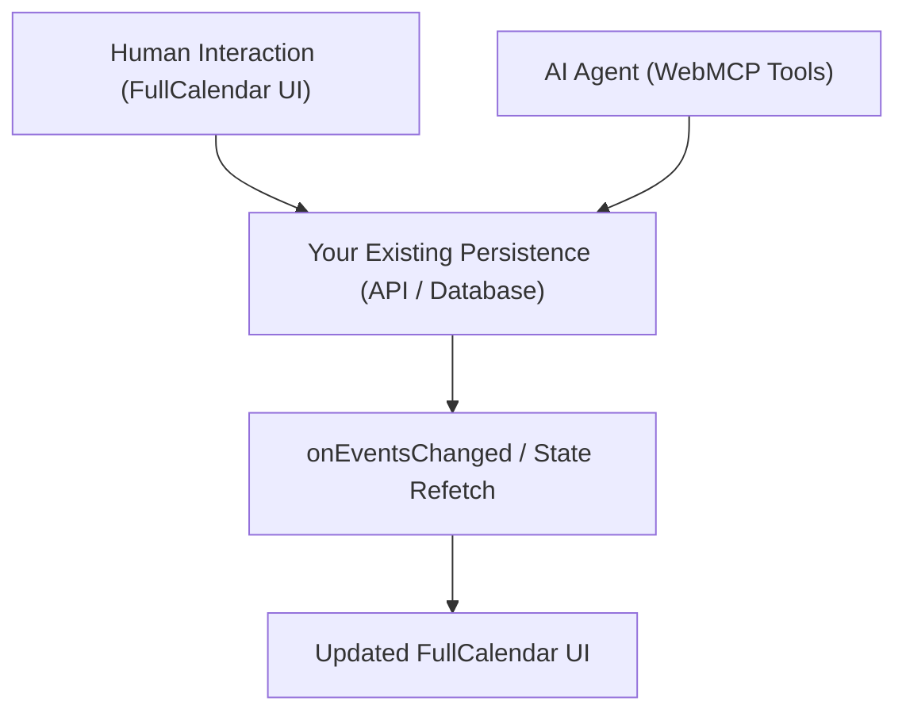

The most important architectural rule in Protocol Tooling is simple:

> **Protocol Tooling does not own your events.**

It does not create a secondary database, maintain a local event ledger, or cache state separately from your application.

## Single source of truth

Human users interacting with FullCalendar (e.g. clicking, dragging, modal editing) and AI agents invoking WebMCP tools converge on the exact same backend and database.

## Why this matters

1. **No data synchronization bugs:** Because Protocol Tooling does not keep its own copy of your event list, there is no risk of agent edits diverging from human edits.
2. **Durability across reloads:** Every mutation made by an agent ([`calendar_create_event`, `calendar_update_event`, `calendar_delete_event`](/concepts/webmcp)) goes straight to your authoritative storage. When the user reloads the page, all changes persist.
3. **Existing validation rules apply:** If your backend rejects an invalid event time, your repository method rejects the promise. The WebMCP tool reports the failure to the agent immediately.

## The mutation lifecycle

When an agent changes an event, the following steps occur:

1. **Agent calls WebMCP tool:** e.g. `calendar_create_event`.
2. **Protocol Tooling invokes repository:** Calls [`events.create(input)`](/reference/calendar-event-repository#createinput-options).
3. **Host application persists event:** Your API creates the record in your database and returns the created `CalendarEvent`.
4. **Protocol Tooling triggers UI refresh:** Calls your `onEventsChanged` callback.
5. **React updates FullCalendar:** Your component refetches the latest event array from your backend and passes it to FullCalendar.
6. **Agent receives confirmation:** The tool returns the created event object back to the browser model context.

For concrete integration steps, see the [Existing App Guide](/guides/existing-app) or the [Repository Contract](/concepts/repository).
