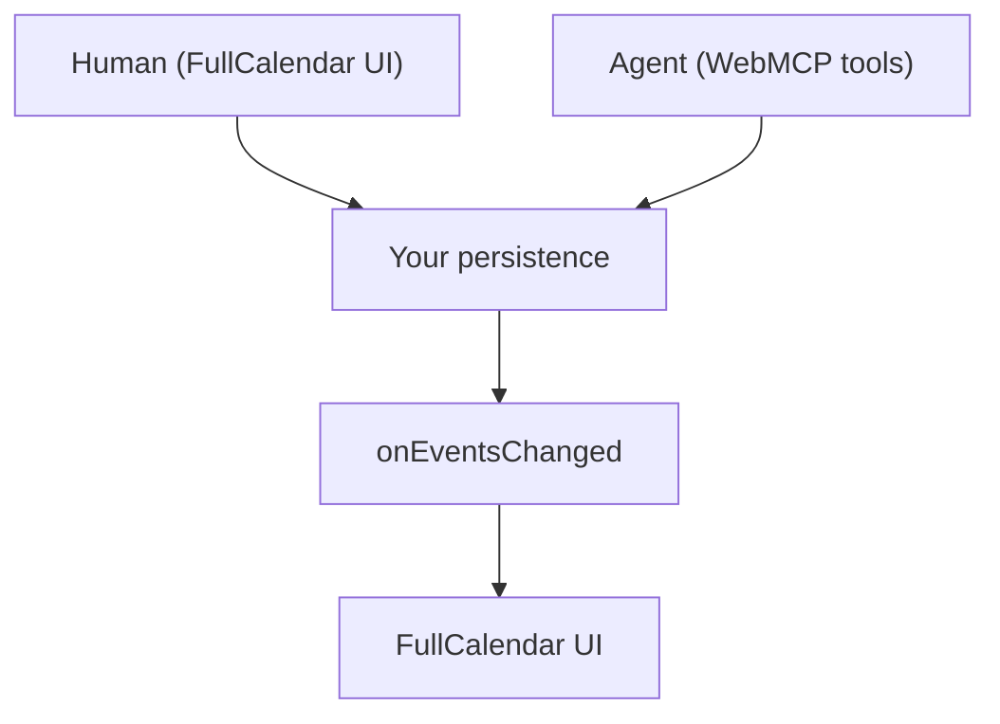

FullCalendar WebMCP does not store calendar events. Your API or database remains the only ledger.

## One source of truth

Human edits in FullCalendar and agent tool calls both go through your persistence. After an agent mutation, `onEventsChanged` refreshes the UI from that same source.

## Why this shape

- No second copy of events to drift out of sync
- Agent changes survive reload when your repository persists them
- Your existing validation and auth keep applying—reject the promise and the tool fails

See [Security](/integrations/fullcalendar/concepts/security) for the full auth/authz model and error propagation expectations.

## What happens on a mutation

1. Agent calls e.g. `calendar_create_event`
2. The integration calls your `events.create`
3. Your backend saves the event and returns a `CalendarEvent`
4. The integration calls `onEventsChanged`
5. Your component reloads events into FullCalendar
6. The tool returns the saved event to the agent

See [Quickstart](/integrations/fullcalendar/quickstart) to wire this up, or [Repository contract](/integrations/fullcalendar/concepts/repository) for the method shapes.
